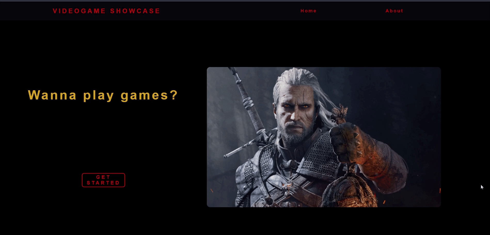

# Videogame Showcase App - Julian Piñel

## About

This is a videogame showcase app implemented in Javascript, featuring:

- Back-End server with a relational database made with PostgreSQL-Sequelize, integrated in NodeJs using Express library.
- Front-End interface made with React Js and Redux; styles made with pure CSS with any external libraries.

## How it works?

Back-End consumes the rawg.io API and fetches games data. This data is processed at backend and concatenated with data stored at Postgres db.
Finally, handles http requests in order to provide Front-End with useful information to display.

Front-End has 5 different routes: Home, About, Catalog, Post and Details:

- Home is the landing page.
- About gives some information about the page and who I am.
- Catalog shows up to 10 games per page, with ordering buttons and filters and a search bar if you are looking for any specific game. Clicking each game with redirect to the Game Detail route.
- Post is a route where users can add their own game to the catalog, which is stored inside the database.

You can take a look at this page <a href="deployed-link" target="_blank" rel="noreferrer">here</a>
